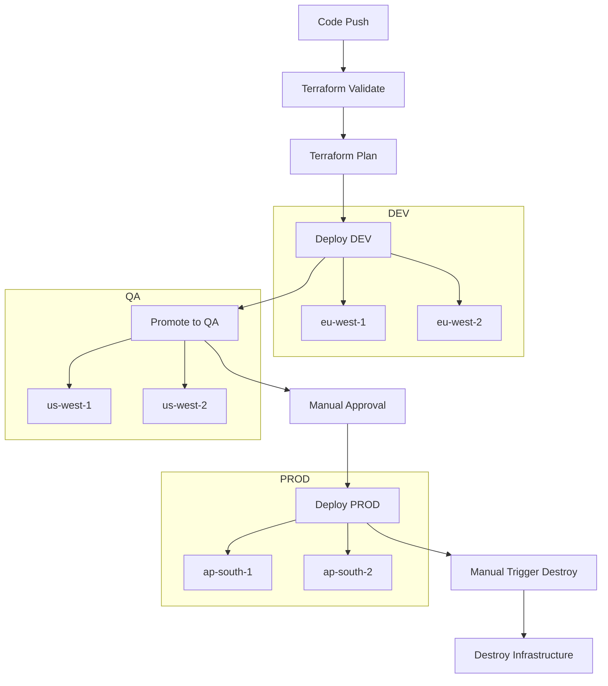

# 🚀 AWS 3-Tier Architecture using Terraform

This project provisions a **production-ready 3-tier architecture on AWS using Terraform**, following Infrastructure as Code (IaC) best practices.

It supports:
- 🌍 **Multi-region deployment** (parallel execution)
- 🏗️ **Multi-environment setup** (dev → qa → prod)
- 🔄 **CI/CD automation using GitHub Actions**
- ♻️ **Reusable workflows for creation & destruction**
- 📦 **Reusable Terraform modules**

---

# 📑 Table of Contents

- [🧱 Architecture Overview](#-architecture-overview)
- [⚙️ Deployment Strategy](#️-deployment-strategy)
  - [Multi-Region Deployment](#-multi-region-deployment)
  - [Multi-Environment Deployment](#-multi-environment-deployment)
  - [CI/CD Workflow Design](#-cicd-workflow-design)
- [📁 Project Structure](#-project-structure)
- [🔧 Prerequisites](#-prerequisites)
- [🪪 Step 1: Create Key Pair](#-step-1-create-key-pair)
- [🔐 Step 2: Configure GitHub Secrets](#-step-2-configure-github-secrets)
- [🧾 Step 3: Create Environment Config Files](#-step-3-create-environment-config-files)
- [🚀 Step 4: Deploy Infrastructure](#-step-4-deploy-infrastructure)
- [🧹 Step 5: Destroy Resources](#-step-5-destroy-resources)
- [💡 Key Highlights](#-key-highlights)
- [🧠 Interview Explanation](#-interview-explanation)

---

# 🧱 Architecture Overview

The infrastructure follows a **3-tier architecture pattern**:

- **Web Tier** → Public-facing EC2 instances behind ALB  
- **App Tier** → Private EC2 instances (business logic)  
- **Database Tier** → RDS (primary + read replica)

---

# ⚙️ Deployment Strategy

## 🔹 Multi-Region Deployment

- Implemented using **GitHub Actions matrix strategy**
- Each environment deploys to **different regions**

| Environment | Regions |
|------------|--------|
| DEV        | eu-west-1, eu-west-2 |
| QA         | us-west-1, us-west-2 |
| PROD       | ap-south-1, ap-south-2 |

---

## 🔹 Multi-Environment Deployment

We follow a **promotion-based deployment model**:

| Environment | Deployment Type |
|------------|----------------|
| DEV        | Automatic |
| QA         | Promotion from DEV |
| PROD       | Manual Approval |

---

## 🔹 CI/CD Workflow Design

This project uses **GitHub Actions reusable workflows**.

### 🔸 Resource Creation
- Trigger: `push`
- Uses reusable workflow
- Handles: init → validate → plan → apply
- Supports:
  - Multi-region (matrix)
  - Multi-environment promotion

### 🔸 Resource Destruction
- Trigger: `workflow_dispatch` (manual)
- Uses reusable workflow
- Safely destroys infrastructure

---

## 🔹 CI/CD Flow



---

# 📁 Project Structure

```
.
├── root-module
│   ├── terraformblock.tf
│   ├── provider.tf
│   ├── main.tf
│   ├── variables.tf
│   ├── outputs.tf
│   ├── datasource.tf
│   ├── locals.tf
│   ├── amzninstall.sh
│   ├── dev.tfvars
│   ├── qa.tfvars
│   └── prod.tfvars
│
├── vpc-module
│   ├── vpc.tf
│   ├── igw.tf
│   ├── subnets.tf
│   ├── route_tables.tf
│   ├── subnets_association.tf
│   ├── eip.tf
│   ├── natgw.tf
│   ├── datasource.tf
│   ├── variables.tf
│   └── outputs.tf
│
├── sg-module
│   ├── main.tf
│   ├── variables.tf
│   └── outputs.tf
│
├── ASG-module
│   ├── load_balancer.tf
│   ├── target_group.tf
│   ├── launch_template.tf
│   ├── auto_scaling_group.tf
│   ├── variables.tf
│   └── outputs.tf
│
├── .github
│   └── workflows
│       ├── terraform-resource-creation-main-pipeline.yml
│       ├── terraform-resource-creation-reusable-pipeline.yml
│       ├── terraform-destroy-resources-main-pipeline.yml
│       └── terraform-destroy-resources-reusable-pipeline.yml
│
└── README.md
```

---

# 🔧 Prerequisites

- AWS Account
- IAM User with required permissions
- GitHub Secrets configured
- Terraform installed (optional for local runs)

---

# 🪪 Step 1: Create Key Pair

```bash
ssh-keygen -t rsa -b 4096 -f terraform-project-key
```

---

# 🔐 Step 2: Configure GitHub Secrets

- AWS_ACCESS_KEY_ID  
- AWS_SECRET_ACCESS_KEY  
- TF_STATE_BUCKET  
- TF_VAR_PUBLIC_KEY  
- DB_PASSWORD_DEV  
- DB_PASSWORD_QA  
- DB_PASSWORD_PROD  

---

# 🧾 Step 3: Create `.tfvars` Files

Create:
- dev.tfvars
- qa.tfvars
- prod.tfvars

---

# 🚀 Step 4: Deploy Infrastructure

Push code → pipeline runs:

1. Validate  
2. Plan  
3. Deploy DEV  
4. Promote QA  
5. Manual approval → PROD  

---

# 🧹 Step 5: Destroy Resources

Run manually:

```
terraform-destroy-resources-main-pipeline.yml
```

---

# 💡 Key Highlights

- ✔ Multi-region per environment  
- ✔ Promotion-based deployments  
- ✔ Reusable CI/CD workflows  
- ✔ Modular Terraform design  
- ✔ Automated cleanup  
